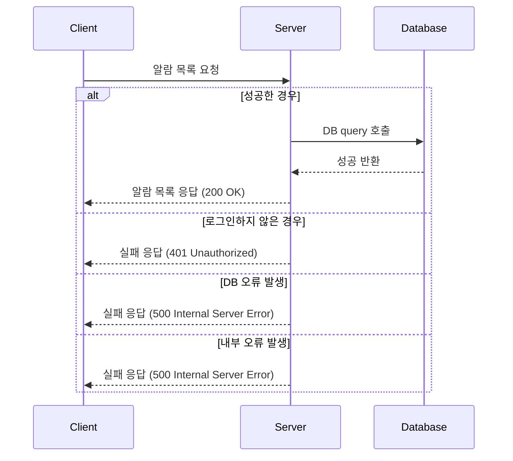

# Connecti - SNS 서비스 플랫폼

Connecti는 사람과 아이디어를 원활하게 연결해주는 소셜 네트워킹 서비스(SNS) 플랫폼입니다.
이 프로젝트는 최신 기술과 프레임워크를 사용해 확장 가능하고, 보안이 뛰어나며, 대규모 트래픽 처리가 가능한 효율적인 SNS 플랫폼을 만드는 것을 목표로 합니다.

## 목차

1. [개요](#개요)
2. [TDD 적용](#tdd-적용)
3. [기술 스택](#기술-스택)
4. [주요 기능](#주요-기능)
5. [배포 시나리오](#배포-시나리오)
6. [설치 방법](#설치-방법)
7. [사용 방법](#사용-방법)

## 개요

Connecti는 확장 가능한 SNS 플랫폼으로, 사용자들이 다음과 같은 기능을 사용할 수 있습니다:

- 회원가입 및 로그인
- 게시물 작성, 수정, 삭제, 조회
- 좋아요 및 댓글 기능
- 상호작용에 따른 실시간 알림 기능
- 캐시와 Server-Side Events(SSE)를 통한 대규모 트래픽 처리

백엔드는 **Spring Boot**로 구현되었으며, **PostgreSQL** 데이터베이스와 연결되어 있습니다. **JWT Authorization**을 통해 API 접근에 대한 보안이 보장됩니다.

## TDD 적용

Connecti 프로젝트에서는 **TDD (Test Driven Development)** 방식을 적용해 개발을 진행했습니다. 이는 코드 작성 전에 테스트를 먼저 설계하여, 코드가 의도대로 동작하는지 지속적으로
검증할 수 있도록 하는 개발 방식입니다.

### TDD의 중요성과 적용 이유

1. **신뢰성 향상**: 기능 구현 전에 테스트를 먼저 작성하므로, 코드가 의도한 대로 동작하는지 확인하며 개발할 수 있습니다. 이를 통해 예상하지 못한 버그를 사전에 방지할 수 있습니다.
2. **유지보수성**: 코드 수정 시 기존 테스트를 통해 코드의 안정성을 유지하며, 새로운 기능을 쉽게 추가할 수 있으며, 기존의 코드가 테스트를 통과하도록 보장되기 때문에, 안정적인 유지보수가 가능합니다.
3. **개발 효율성**: 초기에는 다소 시간이 소요되지만, 테스트를 통한 자동화된 검증으로 인해 장기적인 개발 속도와 품질이 높아집니다.

### Connecti의 TDD 적용 사례

- **회원가입 및 로그인 기능**: 사용자 인증 로직을 구현하기 전에 테스트를 작성하고, 이를 기반으로 기능을 개발했습니다. JWT 기반 인증 체계에서 발생할 수 있는 다양한 시나리오를 미리 정의하여, 코드가 모든
  경우에 대해 올바르게 동작하도록 보장하고자 했습니다.
- **게시물 CRUD 및 상호작용 기능**: 게시물 작성, 수정, 삭제, 조회와 관련된 기능도 TDD 방식을 적용하여 개발하여, 이를 통해 게시물과 사용자 간 상호작용이 안정적으로 동작함을 확인했습니다.

## 기술 스택

Connecti 프로젝트에서 사용되는 기술과 도구는 다음과 같습니다:

### 백엔드

- **Spring Boot**: 백엔드 프레임워크
- **Spring JPA**: 데이터베이스와의 통합을 위한 ORM 기술
- **Spring Security**: JWT를 사용한 인증 및 권한 부여
- **Gradle**: 빌드 자동화 도구
- **Lombok**: 반복되는 코드를 줄여주는 애너테이션 제공
- **PostgreSQL**: 관계형 데이터베이스, 사용자 및 게시물 데이터 저장
- **Heroku**: 초기 배포를 위한 PaaS 플랫폼

### 테스트

- **JUnit 5**: 단위 테스트 프레임워크로 코드 품질을 보장

### 버전 관리

- **Git & GitHub**: 버전 관리 및 협업 도구

## 주요 기능

1. **사용자 인증**: JWT 기반의 보안 인증 및 권한 부여
2. **게시물 CRUD**: 게시물 작성, 수정, 삭제 및 조회 기능
3. **좋아요 및 댓글**: 사용자 간 상호작용을 위한 기능
4. **알림**: Server-Side Events(SSE)를 이용한 실시간 알림
5. **확장성**: Redis 캐싱과 Kafka 이벤트 스트림을 통한 대규모 트래픽 처리

---

## 📢 알람(Notification) 기능

## 📌 기능 개요

- 유저가 게시글에 대한 **댓글** 또는 **좋아요**를 받으면 알림(Notification)이 생성됨.
- 알림 목록을 조회하여 최신 알림을 확인할 수 있음.
- 로그인한 사용자만 자신의 알림을 확인할 수 있음.

---

## 🛠 API 설계

| 메서드      | 엔드포인트                       | 설명                 | 응답             |
|----------|-----------------------------|--------------------|----------------|
| `GET`    | `/api/v1/users/alarms`      | 로그인한 사용자의 알람 목록 조회 | 200 OK         |
| `GET`    | `/api/v1/users/alarms/{id}` | 특정 알람 상세 조회        | 200 OK         |
| `DELETE` | `/api/v1/users/alarms/{id}` | 알람 삭제              | 204 No Content |

---

## 🔄 동작 흐름

아래 시퀀스 다이어그램을 통해 알람 기능의 전체 흐름을 확인할 수 있음.

---

## ⚠ 예외 처리

| 예외 상황            | 응답 코드                       | 설명                 |
|------------------|-----------------------------|--------------------|
| 로그인하지 않은 유저      | `401` Unauthorized          | 로그인해야 알람을 조회할 수 있음 |
| 존재하지 않는 알람 ID 조회 | `404` Not Found             | 요청한 알람이 존재하지 않음    |
| 서버 내부 오류         | `500` Internal Server Error | 예기치 못한 오류 발생       |

---

## 📌 추가 고려 사항

- **알람 목록은 최신순**으로 정렬하여 제공해야 함.
- 알람 읽음 처리 기능 추가 고려.
- 푸시 알람(Notification) 연계 가능성 검토.

---

## 사용 방법

애플리케이션은 `http://localhost:8080`에서 접근할 수 있습니다.

로그인 후 게시물 작성 및 상호작용 기능을 통해 Connecti의 기능을 이용할 수 있습니다. 
